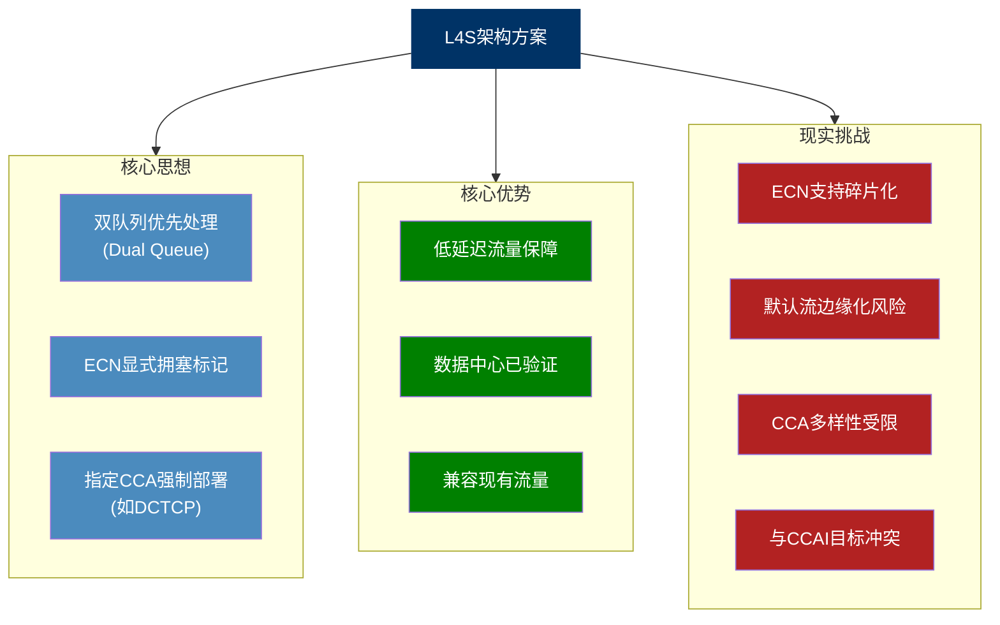

```mermaid
graph TD
    classDef title fill:#003366,color:white,stroke-width:0
    classDef concept fill:#4B8BBE,color:white
    classDef benefit fill:#008000,color:white
    classDef challenge fill:#B22222,color:white

    T[L4S架构方案]:::title

    subgraph 核心思想
        C1["双队列优先处理<br>(Dual Queue)"]:::concept
        C2["ECN显式拥塞标记"]:::concept
        C3["指定CCA强制部署<br>(如DCTCP)"]:::concept
    end

    subgraph 核心优势
        B1["低延迟流量保障"]:::benefit
        B2["数据中心已验证"]:::benefit
        B3["兼容现有流量"]:::benefit
    end

    subgraph 现实挑战
        H1["ECN支持碎片化"]:::challenge
        H2["默认流边缘化风险"]:::challenge
        H3["CCA多样性受限"]:::challenge
        H4["与CCAI目标冲突"]:::challenge
    end

    T --> 核心思想
    T --> 核心优势
    T --> 现实挑战
```