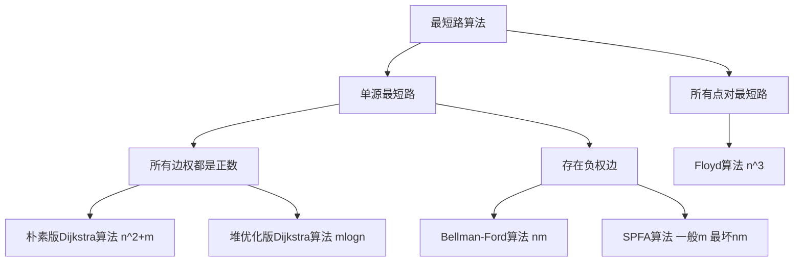
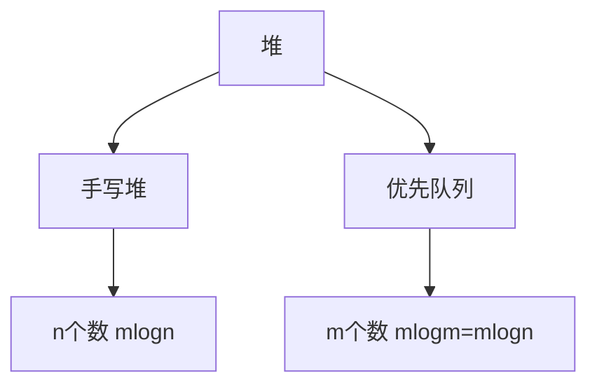

# 搜索与图论

  ## 树与图的存储

### 邻接矩阵

```cpp
g[a][b] 存储边 a -> b
```

### 邻接表

```cpp
// 对于每个点k, 开一个单链表，存储k所有可以走到的点。h[k]存储这个单链表的头结点
int h[N], e[N], ne[N], idx;

// 添加一条边 a->b
void add(int a, int b) {
    e[idx] = b;
    ne[idx] = h[a];
    h[a] = idx;
    idx++;
}

// 初始化
idx = 0;
memset(h. -1. sizeof(h));
```

## 树与图的遍历

**时间复杂度** $O(n + m)$**，n表示点数，m表示边数*。**

### 深度优先搜索

```cpp
int dfs(int u) {
	vis[u] = true;
    
    for (int i = h[u]; i != -1; i = ne[i]) {
        int j = e[i];
        if (!vis[j]) dfs(j);
    }
}
```

### 广度优先搜索

```cpp
queue<int> q;
visit[1] = true;
q.push(1);

while (q.size()) {
    int t = q.front();
    q.pop();
    for (int i = h[t]; i != -1; i = ne[i]) {
		int j = e[i];
        if (!vis[j]) {
            vis[j] = true;
            q.push(j);
        }
    }
}
```

## 拓扑排序

有向无环图又被称为拓扑图

**时间复杂度** $O(n + m)$**，n表示点数，m表示边数**

### 基于广度优先搜索的拓扑排序

```cpp
bool toposort() {
	int hh = 0, tt = -1;
    
    // d[i]存储点i的入度
    for (int i = 1; i <= n; i++) {
		if (!d[i]) q[++tt] = i;
    }
    
    while (hh <= tt) {
        int t = q[hh++];
        for (int i = h[t]; i != -1; i = ne[i]) {
			int j = e[i];
            if (--d[j] == 0) q[++tt] = j;
        }
    }
    
    // 如果所有点都入队了，说明存在拓扑排序；否则不存在拓扑排序
    return tt == n - 1;
}
```

### 基于深度优先搜索的拓扑排序

**顶点完成时刻的逆序**


## 最短路算法



 ### 朴素版Dijkstra算法

**时间复杂度是 $O(n^2+m)$**。

```cpp
int g[N][N]; // 存储每条边
int dist[N]; // 存储1号点到每个点的最短距离
bool st[N];  // 存储每个点的最短路是否已经确定

// 求1号点到n号点的最短路，如果不存在则放回-1
int dijkstra() {
	memset(dist, 0x3f, sizeof(dist));
    dist[1] = 0;
    
    for (int i = 0; i < n - 1; i++) {
        // 在还未确定最短路的点中，寻找距离最小的点
        int t = -1;
    	for (int j = 1; j <= n; j++) 
            if (!st[j] && (t == -1 || dist[t] > dist[j]))
                t = j;
        
        st[t] = true;
        if (t == n) break;
        
        // 用t更新其他点的距离
        for (int j = 1; j <= n; j++)
            dist[j] = min(dist[j], dist[t] + g[t][j]);
    }
    
    if (dist[n] == 0x3f3f3f3f) return -1;
    return dist[n];
}
```

### 堆优化版dijistra算法



 **时间复杂度 $O(mlogn)$。**

```cpp
typedef pair<int, int> PII;		  // first存储距离，second存储节点编号

int n; 						      // 点的数量
int h[N], w[N], e[N], ne[N], idx; // 邻接表存储所有边
int dist[N];				      // 存储所有点到1号店的距离
bool st[N];					      // 存储每个点的最短距离是否已确定

// 求1号点到n号点的最短距离，如果不存在，则返回-1
int dijkstra() {
	memset(dist, 0x3f, sizeof(dist));
    dist[1] = 0;
    priority_queue<PII, vector<PII>, greater<PII>> heap;
    heap.push({0, 1}); 
    
    while(heap.size()) {
		auto t = heap.top();
        heap.pop();
        
        int ver = t.second, distance = t.first;
        
        if (st[ver]) continue;
        st[ver] = true;
        if (ver == n) break;
        
        for (int i = h[ver]; i != -1; i = ne[i]) {
         	int j = e[i];
            if (dist[j] > distance + w[i]) {
				dist[j] = distance + w[i];
                heap.push({dist[j], j});
            }
        }
    }
    
    if (dist[n] == 0x3f3f3f3f) return -1;
    return dist[n];
}
```

### Bellman-Ford算法

**时间复杂度 $O(nm)。$**

==$迭代k次后的dist数组表示不超过k条边到达某个点的最短距离。$==

```cpp
int n, m; // n表示点数，m表示边数
int dist[N]; // dist[x]存储1到x的最短路距离

// 边，a表示出点，b表示入点，w表示边的权重
struct Edge { 
	int a, b, w;
} edges[M];

// 求1到n的最短路距离，如果无法从1走到n，则返回-1
int bellman_ford() {
    memset(dist, 0x3f, sizeof(dist));
    dist[1] = 0;
    
    // 如果第n次迭代仍然松弛成功，则说明存在负权回路
    for (int i = 0; i < n; i++) {
        // 如果题目中利用上面用黄色加深的性质，那么这里需要将dist备份一份
        for (int j = 0; j < m; j++) {
            int a = edges[j].a, b= edges[j].b, w = edges[j].w;
            if (dist[b] > dist[a] + w)
                dist[b] = dist[a] + w;
        }
    }
    
    if (dist[n] > 0x3f3f3f3f / 2) return -1;
    return dist[n];
}
```

### spfa算法（队列优化的Bellman-Ford算法）

**时间复杂度平均情况下 $O(m)$，最坏情况下 $O(nm)$。**

**核心思想是更新过谁，再拿谁更新别人。**

 ```cpp
 int n;  						  // 总点数
 int h[N], w[N], e[N], ne[N], idx; // 领接表存储所有边
 int dist[N];					  // 存储每个点到1号点的最短距离
 bool st[N];						  // 存储每个点是否在队列中
 
 // 求1号点到n号点的最短路距离，如果从1号点无法走到n号点则返回-1
 int spfa() {
     memset(dist, 0x3f, sizeof dist);
     dist[1] = 0;
     
     queue<int> q;
     q.push(1);
     
     while (q.size()) {
         auto t = q.front();
         q.pop();
         
         st[t] = false;
         
         for (int i = h[t]; i != -1; i = ne[i]) {
             int j = e[i];
             if (dist[j] > dist[t] + w[i]) {
                 dist[j] = dist[t] + w[i];
                 if (!st[j]) { // 如果队列中已存在j,则不需要将j重复插入
                     q.push(j);
                     st[j] = true;
                 }
             }
         }
     }
     
     if (dist[n] == 0x3f3f3f3f) return -1;
     return dist[n];
 }
 ```

### spfa判断是否存在负环

**时间复杂度是$O(mn)$，n表示点数，m表示边数。**

**原理**：如果某条最短路径上有n个点（除了自己），那么加上自己之后一共有n+1个点，由抽屉原理一定有两个点相同，所以存在环。

```cpp
int n;      					   // 总点数
int h[N], w[N], e[N], ne[N], idx;  // 邻接表存储所有边
int dist[N], cnt[N];               // dist[x]存储1号点到x的最短距离，cnt[x]存储1到x的最短路中经过的点数
bool st[N];                        // 存储每个点是否在队列中

// 如果存在负环，则返回true，否则返回false。
bool spfa() {
    // 不需要初始化dist数组
    // 需要将所有点在一开始放到队列中
    queue<int> q;
    for (int i = 1; i <= n; i ++ ) {
        q.push(i);
        st[i] = true;
    }

    while (q.size()) {
        auto t = q.front();
        q.pop();

        st[t] = false;

        for (int i = h[t]; i != -1; i = ne[i]) {
            int j = e[i];
            if (dist[j] > dist[t] + w[i])
            {
                dist[j] = dist[t] + w[i];
                cnt[j] = cnt[t] + 1;
                if (cnt[j] >= n) return true; // 如果从1号点到x的最短路中包含至少n个点（不包括自己），则说明存在环
                if (!st[j])
                {
                    q.push(j);
                    st[j] = true;
                }
            }
        }
    }

    return false;
}
```

### floyd算法 

**时间复杂度是$O(n^3)$，$n$表示点数**

```cpp
void init() {
    for (int i = 1; i <= n; i++) 
        for (int j = 1; j <= n; j++) 
            if (i == j) d[i][j] = 0;
            else d[i][j] = INF;
}

void floyd() {
    for (int k = 1; k <= n; k++) 
        for (int i = 1; i <= n; i++)
            for (int j = 1; j <= n; j++)
                d[i][j] = min(d[i][j], d[i][k] + d[k][j]);
}
```

## 最小生成树

### Prim算法

**朴素版Prim算法时间复杂度是$O(n^2+m)$，适用于稠密图。**

**优化版Prim算法时间复杂度是$O(mlogn)$，适用于稀疏图，一般不用。**

```cpp
int n;		    // n表示点数
int g[N][N];	// 邻接矩阵，存储所有边
int dist[N];	// 存储其他点到当前最小生成树的距离
bool st[N];		// 存储每个点是否已经在生成树中

// 如果图不连通，返回INF；否则返回最小生成树的树边权重之和
int prim() {
    memset(dist, 0x3f, sizeof(dist));
    
    int res = 0;
    for (int i = 0; i < n; i++) {
        int t = -1;
        for (int j = 1; j <= n; j++) 
            if (!st[j] && (t == -1 || dist[t] > dist[j]))
                t = j;
        
        if (i && dist[t] == INF) return INF;
        
        if (i) res += dist[t];
        st[t] = true;
        
        for (int j = 1; j <= n; j++) 
            dist[j] = min(dist[j], g[t][j]);
    } 
    
    return res;
}
```

### Kruskal算法

**时间复杂度是$O(mlogm)$。**

1. 将所有边按权重从小到大排序
2. 枚举每条边<a, b, c>
   * 如果a与b不连通，将边加入集合中

```cpp
int n, m;	// n是点数，m是边数
int p[N];	// 并查集的父节点数组

struct Edge	{
    int a, b, w;
   
    bool operator< (const Edge &W) const {
		return w < W.w;
    }
} edges[M];

int find(int x) {
    if (p[x] != x) p[x] = find(p[x]);
    return p[x];
}

int kruskal() {
    // 排序
    sort(edges, edges + m);
    
    // 初始化并查集
    for (int i = 1; i <= n; i++) p[i] = i;

	int res = 0, cnt = 0;
	for (int i = 0; i < m; i++) {
        int a = edges[i].a, b = edges[i].b, w = edges[i].w;
        
        a = find(a), b = find(b);
        if (a != b) {
            p[a] = b;
            res += w;
            cnt++;
        }
    }
    
    if (cnt < n - 1) return INF;
    return res;
}
```

## 二分图

### 染色法判别二分图

一个图是二分图 当且仅当 图中不含奇数环

**时间复杂度是$O(n+m)。$**

```cpp
int n;						// n表示点数
int h[N], e[M], ne[M], idx; // 领接表存储图
int color[N];				// 表示每个点的颜色，-1表示未染色，0表示白色，1表示黑色

// 参数：u表示当前节点，c表示当前点的颜色
bool dfs(int u, int c) {
    color[u] = c;
    for (int i = h[u]; i != -1; i = ne[i]) {
		int j = e[i];
        if (color[j] == -1) {
            if (!dfs(j, !c)) return false;
        }
        else if (color[j] == c) return false;
    }
    return true;
}

bool check() {
    memset(color, -1, sizeof(color));
    bool flag = true;
    for (int i = 1; i <= n; i++) {
        if (color[i] == -1) {
            if (!dfs(i, 0)) {
                flag = false;
                break;
            }
        }
    }
    return flag;
}
```

### 匈牙利算法

**时间复杂度是$O(nm)$。**

```cpp
int n1, n2;					// n1表示第一个集合中的点数，n2表示第二个集合中的点数
int h[N], e[M], ne[M], idx;	// 邻接表存储所有边，只用存一个方向的边
int match[N];				// 存储第二个集合中的每个点当前匹配的的第一个集合中的点是哪个
bool st[N];					// 表示第二个集合中的每个点是否已经被遍历过

bool find(int x) {
    for (int i = h[x]; i != -1; i = ne[i]) {
        int j = e[i];
        if (!st[j]) {
            st[j] = true;
            if (match[j] == 0 || find(match[j])) {
                match[j] = x;
                return true;
            }
        }
    }
    
    return false;
}

// 求最大匹配数，依次枚举第一个集合中的每个点能否匹配第二个集合中的点
int res = 0;
for (int i = 1; i <= n1; i++) {
    memset(st, false, sizeof(st));
    if (find(i)) res++;
}
```

