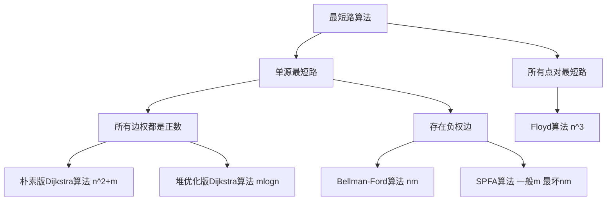
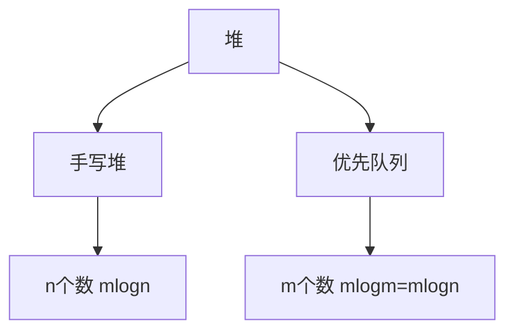

# 搜索与图论

  ## 树与图的存储

### 邻接矩阵

```cpp
g[a][b] 存储边 a -> b
```

### 邻接表

```cpp
// 对于每个点k, 开一个单链表，存储k所有可以走到的点。h[k]存储这个单链表的头结点
int h[N], e[N], ne[N], idx;

// 添加一条边 a->b
void add(int a, int b) {
    e[idx] = b;
    ne[idx] = h[a];
    h[a] = idx;
    idx++;
}

// 初始化
idx = 0;
memset(h. -1. sizeof(h));
```

## 树与图的遍历

**时间复杂度** $O(n + m)$**，n表示点数，m表示边数*。**

### 深度优先搜索

```cpp
int dfs(int u) {
	vis[u] = true;
    
    for (int i = h[u]; i != -1; i = ne[i]) {
        int j = e[i];
        if (!vis[j]) dfs(j);
    }
}
```

### 广度优先搜索

```cpp
queue<int> q;
visit[1] = true;
q.push(1);

while (q.size()) {
    int t = q.front();
    q.pop();
    for (int i = h[t]; i != -1; i = ne[i]) {
		int j = e[i];
        if (!vis[j]) {
            vis[j] = true;
            q.push(j);
        }
    }
}
```

## 拓扑排序

有向无环图又被称为拓扑图

**时间复杂度** $O(n + m)$**，n表示点数，m表示边数**

### 基于广度优先搜索的拓扑排序

```cpp
bool toposort() {
	int hh = 0, tt = -1;
    
    // d[i]存储点i的入度
    for (int i = 1; i <= n; i++) {
		if (!d[i]) q[++tt] = i;
    }
    
    while (hh <= tt) {
        int t = q[hh++];
        for (int i = h[t]; i != -1; i = ne[i]) {
			int j = e[i];
            if (--d[j] == 0) q[++tt] = j;
        }
    }
    
    // 如果所有点都入队了，说明存在拓扑排序；否则不存在拓扑排序
    return tt == n - 1;
}
```

### 基于深度优先搜索的拓扑排序

**顶点完成时刻的逆序**


## 最短路算法



 ### 朴素版Dijkstra算法

**时间复杂度是 $O(n^2+m)$**。

```cpp
int g[N][N]; // 存储每条边
int dist[N]; // 存储1号点到每个点的最短距离
bool st[N];  // 存储每个点的最短路是否已经确定

// 求1号点到n号点的最短路，如果不存在则放回-1
int dijkstra() {
	memset(dist, 0x3f, sizeof(dist));
    dist[1] = 0;
    
    for (int i = 0; i < n - 1; i++) {
        // 在还未确定最短路的点中，寻找距离最小的点
        int t = -1;
    	for (int j = 1; j <= n; j++) 
            if (!st[j] && (t == -1 || dist[t] > dist[j]))
                t = j;
        
        st[t] = true;
        if (t == n) break;
        
        // 用t更新其他点的距离
        for (int j = 1; j <= n; )
            dist[j] = min(dist[j], dist[t] + g[t][j]);
    }
    
    if (dist[n] == 0x3f3f3f3f) return -1;
    return dist[n];
}
```

### 堆优化版dijistra算法



 **时间复杂度 $O(mlogn)$。**

```cpp
typedef pair<int, int> PII;

int n; 						// 点的数量
int h[N], w[N], ne[N], idx; // 邻接表存储所有边
int dist[N];				// 存储所有点到1号店的距离
bool st[N];					// 存储每个点的最短距离是否已确定

// 求1号点到n号点的最短距离，如果不存在，则返回-1
int dijkstra() {
	memset(dist, 0x3f, sizeof(dist));
    dist[1] = 0;
    priority_queue<PII, vector<PII>, greater<PII>> heap;
    heap.push({0, 1}); // first存储距离，second存储节点编号
    
    while(heap.size()) {
		auto t = heap.top();
        heap.pop();
        
        int ver = t.second, distance = t.first;
        
        if (st[ver]) continue;
        st[ver] = true;
        if (ver == n) break;
        
        for (int i = h[ver]; i != -1; i = ne[i]) {
         	int j = e[i];
            if (dist[j] > distance + w[i]) {
				dist[j] = distance + w[i];
                heap.push({dist[j], j});
            }
        }
    }
    
    if (dist[n] == 0x3f3f3f3f) return -1;
    return dist[n];
}
```

### Bellman-Ford算法

**时间复杂度 $O(nm)。$**

==$迭代k次后的dist数组表示不超过k条边到达某个点的最短距离。$==

```cpp
int n, m; // n表示点数，m表示边数
int dist[N]; // dist[x]存储1到x的最短路距离

// 边，a表示出点，b表示入点，w表示边的权重
struct Edge { 
	int a, b, w;
} edges[M];

// 求1到n的最短路距离，如果无法从1走到n，则返回-1
int bellman_ford() {
    memset(dist, 0x3f, sizeof(dist));
    dist[1] = 0;
    
    // 如果第n次迭代仍然松弛成功，则说明存在负权回路
    for (int i = 0; i < n; i++) {
        // 如果题目中利用上面用黄色加深的性质，那么这里需要将dist备份一份
        for (int j = 0; j < m; j++) {
            int a = edges[j].a, b= edges[j].b, w = edges[j].w;
            if (dist[b] > dist[a] + w)
                dist[b] = dist[a] + w;
        }
    }
    
    if (dist[n] > 0x3f3f3f3f / 2) return -1;
    return dist[n];
}
```

### spfa算法（队列优化的Bellman-Ford算法）

**时间复杂度平均情况下 $O(m)$，最坏情况下 $O(nm)$。**

**核心思想是更新过谁，在拿谁更新别人。**

 
